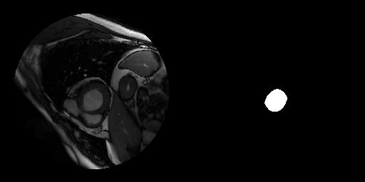
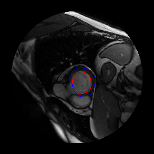
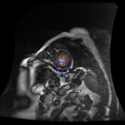
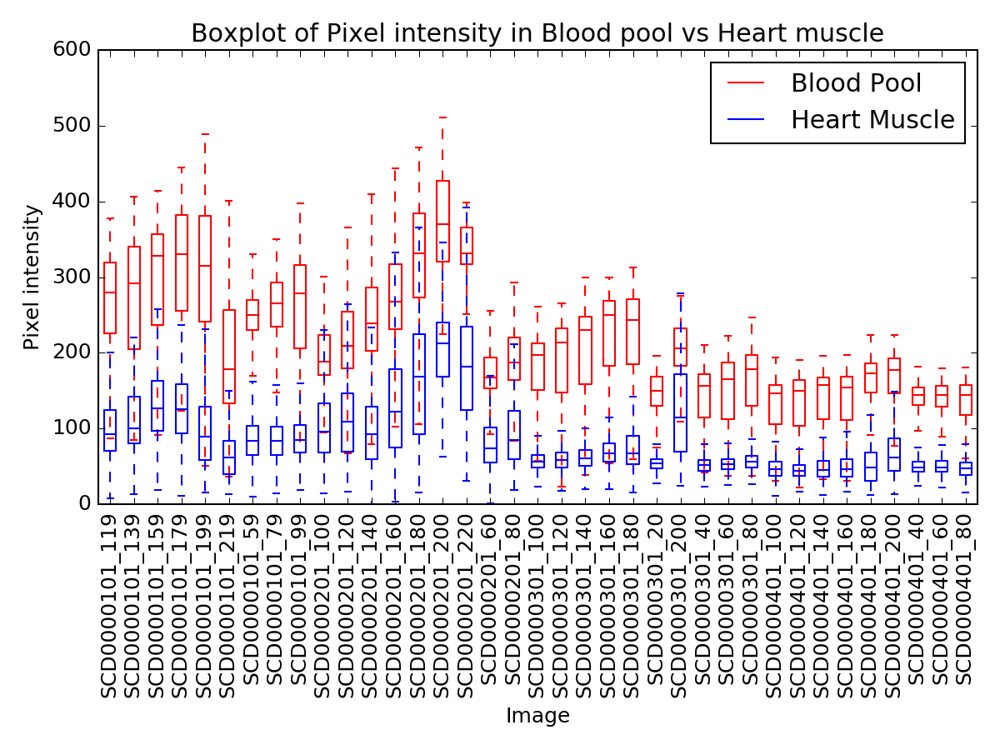
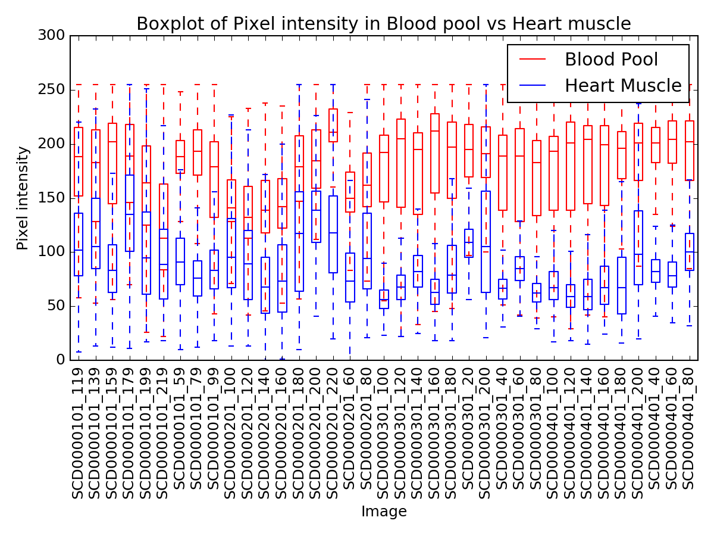
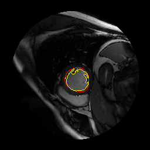

# Overview
The project aims to parse DICOM and corresponding Contour files and identify i-contour .

Relevant code files:
```
root
 |---pipelines
 |     |------pipeline_dicom_contour.py: This is the main pipeline that perform the parsing and prepare dataset
 |     |------dicom_contour_analysis.py: This is the main analysis for data visualization and simple image processing (new code for Phase 2)
 |---utils
 |     |---parsing.py: contains provided file/data parsing functions
 |     |---dataset.py: contains ImageData class (for parsing) and data_geneartor (for iterating through data)
 |     |---image_processing.py: contains functions to create, transform and save images (new code for Phase 2)
 |     |---metrics.py: contains evaluation metric functions for segmentation task (new code for Phase 2)
 |---tests
       |---unit
            |---utils
                 |----test_parsing.py: contains unittest for utils/parsing.py
                 |----test_dataset.py: contains unittest for utils/dataset.py
                 |----test_image_processing.py: contains unittest for utils/image_processing.py (new code for Phase 2)
                 |----test_metrics.py: contains unittest for utils/metrics.py (new code for Phase 2)
```

# PHASE 1: DATA PROCESSING
## Part 1: Parse the DICOM images and Contour Files
#### Assumption
- The pipeline only parses DICOM images and i-contour files that are matched together. Files that do not have corresponding DICOM/i-contour counterpart are probably not useful at the moment and will not be parsed.
- The pipeline keeps the parsed output in memory (for subsequent processing) instead of saving the output to storage
- There is no information on how a DICOM image should be matched with a contour file. I make a guess that for a patient, a XYZ.dcm DICOM image should be match with IM-0001-0XYZ-icontour-manual.txt contour file.


#### 1. How did you verify that you are parsing the contours correctly?
I verify that the contours are parsed correctly by:
- writing unittest for parsing functions to ensure they have the intended output
- saving the generated outputs of DICOM image data and contour binary mask side-by-side and visually comparing the outputs.
There 96 matching DICOM-contour pairs. The generated outputs for these pairs are available at: https://drive.google.com/drive/folders/1Gq05iVeGwnDG3coyE3WQr1GccCZ0O8lX?usp=sharing

A sample output of image data and contour binary mask putting side-by-side is shown below:<br/>
<br/>


#### 2. What changes did you make to the code, if any, in order to integrate it into our production code base?
I made the following changes to the code:
* add some validation in parsing functions, e.g check if file exists, check if a value can be parsed to float
* add unittests (although I do not have time to make it comprehensive)
* use logger to log relevant information and error when running the pipeline for inspection.
The log generated when the pipeline runs is available at: https://drive.google.com/file/d/1U88gh7pFC4K_tSQWyLK36rJA4EKH_dyu/view?usp=sharing
* replace some hard-coded variables with global variables to avoid inconsistency
* make changes to some strange logics:

In _parse_dicom_file_ function, check if an attribute exists in dcm object instead of trying to run the code and catch exception:
```bash
    try:
        intercept = dcm.RescaleIntercept
    except AttributeError:
        intercept = 0.0
    try:
        slope = dcm.RescaleSlope
    except AttributeError:
        slope = 0.0
```
<br/>In _parse_dicom_file_ function, the below logic might miss out required data transformation in cases where intercept or slope is actually zero (although slope=0.0 means the DICOM data might not be correct and needs to be verified)
```python
    if intercept != 0.0 and slope != 0.0:
        dcm_image = dcm_image*slope + intercept
```

<br/>In _parse_dicom_file_ function, it is strange that pixel data is stored in a dict instead of being returned directly. I suppose we might want to add in attributes other than pixel data later, so I did not make any change here
```python
    dcm_dict = {PIXEL_FIELD: dcm_image}
    return dcm_dict
```     

<br/>In _poly_to_mask_ function, it might be better to also draw with outline=1 to avoid missing out pixels, although this probably does not affect the model result. I did not make this change
```python
    ImageDraw.Draw(img).polygon(xy=polygon, outline=0, fill=1)
```

 
## Part 2: Model training pipeline
#### 1. Did you change anything from the pipelines built in Parts 1 to better streamline the pipeline built in Part 2? If so, what? If not, is there anything that you can imagine changing in the future?
I made the following changes to the pipelines built in Parts 1 to better streamline the pipeline built in Part 2:
* I keep patient/image ID as part of parsed output. For model training and evaluation, we might need to perform train/test split at patient level instead of at image level. So, we would need to have patient/image ID to perform the split.
* If we find that other attributes in DCOM files (e.g. orientation) would be useful, I imagine that we would want to parse those information as well 
* We might want to perform image augmentation for model training. In that case, I imagine that we can either:
  - Add image augmentation code to the pipeline before the model training
  - (Or) Add image augmentation code to data generator to perform augmentation as we generate data for training

#### 2. How do you/did you verify that the pipeline was working correctly?
* I added unittest for data_generator
* I also looked at the log to inspect (or even assert) that the data shape and index generated in each epoch are as expected


#### 3. Given the pipeline you have built, can you see any deficiencies that you would change if you had more time? If not, can you think of any improvements/enhancements to the pipeline that you could build in?
I would consider adding the below improvements to the pipeline:
* In case we have many observations to parse, I would use multi-threading to parse data
* In case the data is too large to store in memory, instead of parsing the whole dataset and keep it in memory, I can either:
    - separate the two pipelines: save the parsed data to storage in Part 1 and use a data generator to load data as needed in each training step/epoch in Part 2
    - (or) use a data generator to parse data as needed in each training step/epoch
* Add more tests and input validations


# PHASE 2: DATA SCIENCE/ANALYSIS
## Part 1: Parse the o-contours
#### 1. After building the pipeline, please discuss any changes that you made to the pipeline you built in Phase 1, and why you made those changes.
I made the following changes to the pipelines built in Phase 1:
- I add to _ImageData_ class parameters to specify whether the pipeline parses only i-contour, only o-contour or both (default), so that we can parse different folders depending on the data we want to analyze. If both i-contour and o-contour are needed, the pipeline parses DICOM images, i-contour files and o-contour files that are matched together. Files that do not have corresponding DICOM/i-contour counterpart are probably not useful at the moment and will not be parsed.
- This is not directly related to Part 1, but I also make the pipeline save parsed data to storage instead of keeping it in memory to facilitate running different analysis/modelling without re-running the data parsing.
- I change the visualization output from drawing mask to drawing boundaries of the masks. With multiple masks, drawing the boundaries make it easier to examine the data. The visualization is available at: https://drive.google.com/open?id=1HFEJF3cDnMuKs3dhOVSahzsAfvdsNhwZ

An example of the updated visualization output is shown below (Red indicates i-contour or blood pool, Blue indicates o-contour or heart muscle):<br/>
<br/>

By examining the visualization outputs, I notice that o-contour files of images from patient SCD0000501 seem to be incorrect. These images are excluded from analysis in part 2 (until we vertify the correctness of these contour files).<br/>
<br/>

## Part2: Heuristic LV Segmentation approaches
#### Assumption:
* Simple thresholding scheme means we use __one specific threshold__ to separate blood pool heart muscle areas.
* We want to have a segmentation approachs that are generalizable, i.e. approaches that should work across different images.

#### 1. Could you use a simple thresholding scheme to automatically create the i-contours, given the o-contours?
* To check whether I can find a specific threshold to separate blood pool vs heart muscle areas, I can plot pixel intensity of blood pool vs heart muscle for each image:<br/>
<br/>

Each boxplot shows minimum, first quartile, median, third quartile, and max values of pixel intensity in an image. A good threshold should separate majority of blood pool pixel intensity from majority of heart muscle pixel intensity.
<br/>From the boxplot, we see that pixel intensity's interquartile range of blood pool in one image can overlap with that of heart muscle in other images. That means, we would not be able to find a specific threshold that would work well across different images. Therefore, we cannot use simple thresholding scheme in this case.

* I also try to generate boxplot for normalized pixel intensity (i.e. pixel intensity normalized to 0-255 range for each image):<br/>
<br/>

We still see that pixel intensity's interquartile range of blood pool in one image can overlap with that of heart muscle in other images. So, simple thresholding scheme will not work.

#### 2. Do you think that any other heuristic (non-machine learning)-based approaches, besides simple thresholding, would work in this case? Explain.
Although pixel intensity's interquartile range (i.e majority) of blood pool in one image can overlap with that of heart muscle in other images, pixel intensity's interquartile range of blood pool and hear muscle in the same image rarely overlap. That means adaptive heuristic-based approaches for individual image would potential work.
I can think of several heuristic-based approaches:
* __Adaptive and Otsu thresholding__: Find an optimal threshold to separate pixel intensity in an image into 2 classes.
* __Edge detection__: Apply edge detection filters to find edges inside o-contours. Those edges are likely to correspond to boundaries of blood pool
* Images of each person seems to correspond to a time-series. Perhaps, __object tracking__ approach might work if we manually annotate i-contour of the 1st image for each patient.

The initial output of these approaches might be "noisy", so we can perform post-processing to obtain better segmentation, based on expert knowledge. Below are some of my guesses:
* Each image should probably have only one blood pool area inside o-contour. So, we can apply opening operation and/or contour analysis to remove noise and select the largest contour to be the blood pool segmentation.
* Since boundaries of blood pool seem to be smooth, we can apply convex hull or curve interpolation to make the segmentation more smooth.

I implemented a quick prototype with Otsu thresholding approach and convex hull postprocessing. The segmentation result is available at: https://drive.google.com/open?id=12nfiO3uest38Im7x-Ft4bb6GveFfDIF4

A sample output is shown below:<br/>
Left - Otsu thresholding, Right - Otsu thresolding with convex hull post processing.<br/>
 <br/>

To evaluate the segmentation result quantitatively, I look at Intersection over Unition (IoU) score and Dice (F1) score:

| Approach  | Mean (Std) of IoU Score | Mean (Std) of Dice Score |
| ------ | -------- | -------- |
| Otsu threshol | 0.769 (0.096) | 0.865 (0.068) |
| Otsu threshold + Convex Hull | 0.827 (0.099) | 0.901 (0.071) |


#### 3. What is an appropriate deep learning-based approach to solve this problem?
Deep learning-based approaches related to semantic segmentation or object detection would potentially work for this problem. I can think of several specific deep learning-based models:
* __Semantic segmentation approach__: U-Net
* __Object detection approach__: Mask R-CNN
* If images of each person seems correspond to a time-series, combining recurrent architecture with convolution architecture could help improve i-contour mask prediction.

In these deep learning approaches, model input is the pixel data and model output is i-contour mask. If we have o-contour mask, we can concatenate it as part of the model input.
The difference between U-Net and Mask R-CNN lies in their convolution architectures:
* U-Net has a series of convolution/MaxPooling for representation learning, then transposed convolution (and skip connection) to predict the i-contour mask.
* Mask-RCNN has a region proposal network to proposal region of interests, then perform fine-tuning segmentation on the regions to predict one or more i-contour masks.

If we want to find multiple i-contours that might overlap each other in an image, Mask R-CNN would be appropriate. In this case, we only expect one i-contour per image, so U-Net would be more appropriate.


#### 4. What are some advantages and disadvantages of the deep learning approach compared your chosen heuristic method?
Advantages of the deep learning approach (e.g. U-Net) compared to heuristic-based method (e.g. Otsu Thresholding):
* Deep learning approach work without manually "hand-crafted" feature extraction (pixel intensity, edge detection, etc)
* Deep learning approach can potentially work without o-contour mask. I imagine without o-contour mask, the segmentation of i-contour would be challenging with Otsu thresholding due to other areas with similar pixel intensity in an image.
* If we have a representative dataset with annotation, Deep learning would potentially outperform heuristic-based method in challenging segmentation tasks.

Disadvantages of the deep learning approach (e.g. U-Net) compared to heuristic-based method (e.g. Otsu Thresholding):
* The Deep learning approach requires annotated mask of i-contour to train
* It is prone to overfitting and difficult to find global optima if we don't have a large and respresentative dataset, although we can use transfer learning to mitigate this challenge.
* Convolution operation is not invariant to scale and rotation. We usually need to perform data augmentation when training convolutional neural networks to mitigate this challenge.

